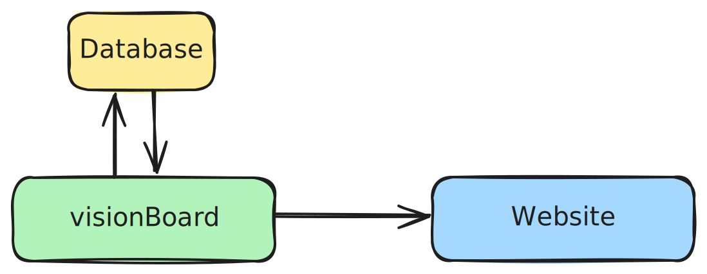
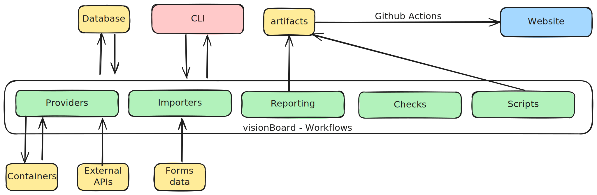

# Architecture

This project is part of the [openPathfinder](https://github.com/OpenPathfinder) initiative, and it is playing a key role. In this document, you can find more details on the project's architecture.

## Context

The [visionBoard](https://github.com/OpenPathfinder/visionBoard) project mission is to collect data from external sources, generate intelligence from that data, and store the information in a database (PostgreSQL). In simple terms, we run "checks" against the database to understand the health of the projects.

Later, this data is used by other projects to showcase information to users (compliance checks, reports, etc.) in [the website](https://github.com/OpenPathfinder/website). You can find more details about the integration in [this pipeline](https://github.com/OpenPathfinder/website/blob/cec1882d60d62502aa07e43980b1133f0525c036/.github/workflows/sync_checks.yml#L41).

## Entities

As this project originated as "the dashboard" for the OpenJS Foundation, we followed the same entities organization. Essentially, the foundation [has projects](https://openjsf.org/projects) that can lead to multiple GitHub Organizations, with several repositories in each.

Most of the data enrichment is done against repositories or organizations, while the checks are performed against projects themselves and other tables.

### Database Schemas

You can find the SQL structure updated in [src/database/schema/schema.sql](src/database/schema/schema.sql) if you want to use an external program to view the database structure.

## Internal Parts

Let’s look inside the visionBoard. Essentially, we have a CLI tool that triggers actions such as pulling data from the GitHub API or running checks against the stored information in the database.

### Diagram

In this diagram, we can see that the CLI is the main way users interact with the tool (also via scripts using `npm`), and we use the database to retrieve and store information.

Internally, we have providers, importers, reporting, checks, and scripts. These components are specialized to accomplish specific tasks. Each section has its own domain and capabilities, which are isolated from each other for better testing and composability. This allows us to reuse components across workflows.

### Parts

#### CLI

We often refer to `workflows` and `checks`—terms used in the CLI to organize user actions. Ideally, a workflow abstracts certain steps, such as pulling data from an external source and updating the database.

The workflows and CLI commands are defined in specific folders ([src/workflows](src/workflows) and [src/cli](src/cli)), and general instructions can be found in [the README.md](README.md#usage).

#### Providers

Providers are external entities we connect to in order to retrieve relevant data. The providers can be found in [src/providers](src/providers).

One prominent integration is with the GitHub API, where we collect information about repositories, organizations, branches, etc. This integration is done using the HTTP API.

We also retrieve information by running containers, as in the case of the OSSF Scorecard, where we use the official image to run our own analysis ([ref](https://github.com/OpenPathfinder/visionBoard/pull/62)). For this, we use the [child process](https://nodejs.org/api/child_process.html) core library.

Regardless of whether the data comes from containers or APIs, we validate it to ensure quality before storing it in the database. The schemas can be found in [src/schemas](src/schemas).

#### Importers

While in development ([ref](https://github.com/OpenPathfinder/visionBoard/issues/56)), the main idea is to bulk upsert information about the projects. This information is "manually" added by the maintainers and human-curated before ingestion. This source of data also undergoes JSON Schema validation, with schemas located in [src/schemas](src/schemas).

#### Scripts

We have several [scripts](scripts) that can be executed as npm commands. These scripts support external integrations with other tools and primarily query and prepare information from the database.

In the future, these scripts may extend to other tasks related to the project's developer experience (DevEx).

#### Checks

Checks, or compliance checks, are the core of this project. They analyze information from the database to answer questions like "Do all my repositories have branch protection enabled?" After a check is completed, its results, alerts, and tasks are added to the database.

Checks do not collect information and aim to work independently, following principles similar to unit testing:
- **Fast**: They should not run containers or query external sources—only database information is used.
- **Isolated**: There should be no dependencies between checks.
- **Repeatable**: Running a check multiple times should yield the same results.
- **Self-validating**: No manual interaction is required.
- **Immutable**: The same input produces the same output.

#### Reporting

An ongoing initiative ([ref](https://github.com/OpenPathfinder/visionBoard/milestone/4)) aims to generate reports after checks are run. These reports will help maintainers and users understand the status and what actions to take.

These reports may contain sensitive information (under discussion) and are considered artifacts.

#### Database

We use a PostgreSQL database. Detailed information about database management, including migrations and seeds, is in [the README.md](README.md#database-management).

To interact with the database, we have a store ([src/store](src/store)) that provides all the methods for querying the database.

For testing, we utilize resources such as [__fixtures__](__fixtures__) and [__utils__](__utils__).

#### Artifacts

This project’s responsibility is to generate artifacts that other tools can consume, not to showcase the information. Artifacts are generated in various formats (JSON, Markdown, HTML) and stored in the [output](output) directory, which is ignored in Git.
